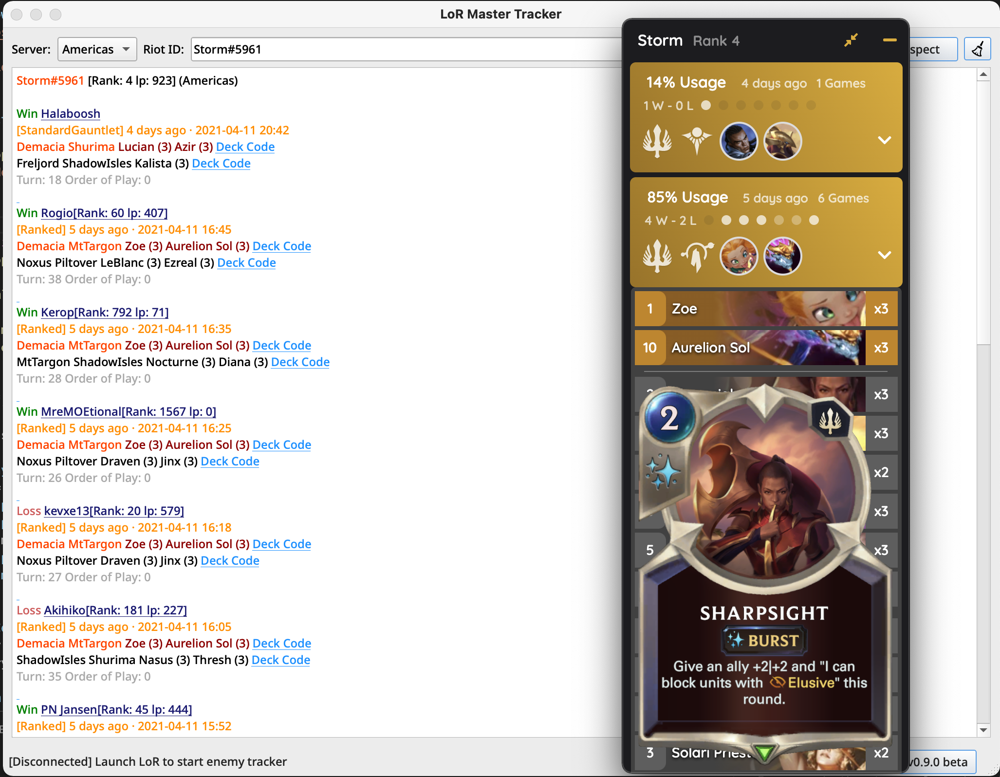
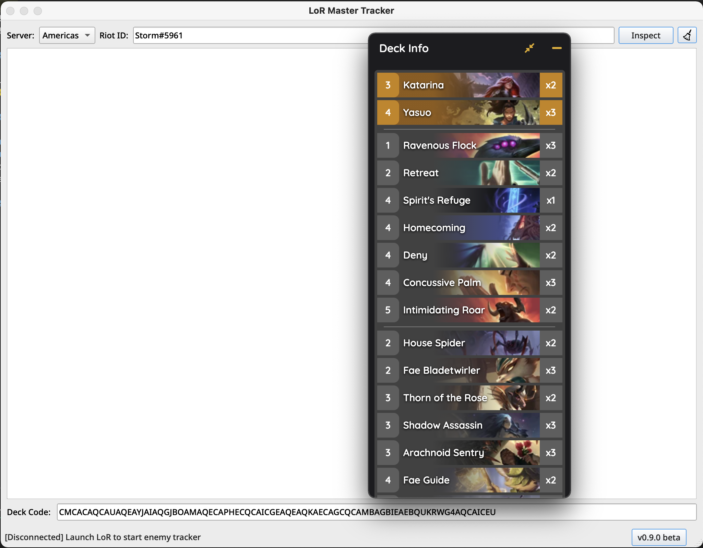

# LoR Master Tracker-beta

    
    <a href="https://www.python.org/downloads/">.svg"/></a>
    

LoR Master Tracker is a history tracker and deck inspector for League of Runeterra.

## Installation

* Requirements: Windows 7 or higher
* [Click here to download](https://github.com/shaobaili3/LoR_Master/releases/download/v0.9.0-beta/LoRMasterTracker-v0.9.0-beta.exe)
* [Changelogs](https://github.com/shaobaili3/lor_master/releases)

## Features

* **Player Match History Inspector**

    By simply providing the player name, LMT can inspect recent rank matches. Multiple Language player names are supported.

* **In-game Enemy Deck Tracker**

    At the game beginning, the opponent deck, rank and lp automatically revealed by real-time enemy tracker.

## Development (Open-source next version)

LoR Master Tracker backend is written by pure [Python3](https://www.python.org/downloads/) for cross-platform and local port retrieval. The main Interface is built by [PyQt6](https://riverbankcomputing.com/software/pyqt/download), the In-game UI is built by [Electron](https://www.electronjs.org/) and [Vuejs](https://github.com/vuejs/vue)

## FAQ

**Q.** Is using LoR Master Tracker considered cheating?  
**A.** This project is registered in the [Riot Development Portal](https://developer.riotgames.com/) and the API key is proved by [Riot](https://www.riotgames.com/en). All data source is from [Riot API](https://developer.riotgames.com/apis) and [LoR Data Dragon](https://developer.riotgames.com/docs/lor). There is zero third-party data source and no third-party API.
